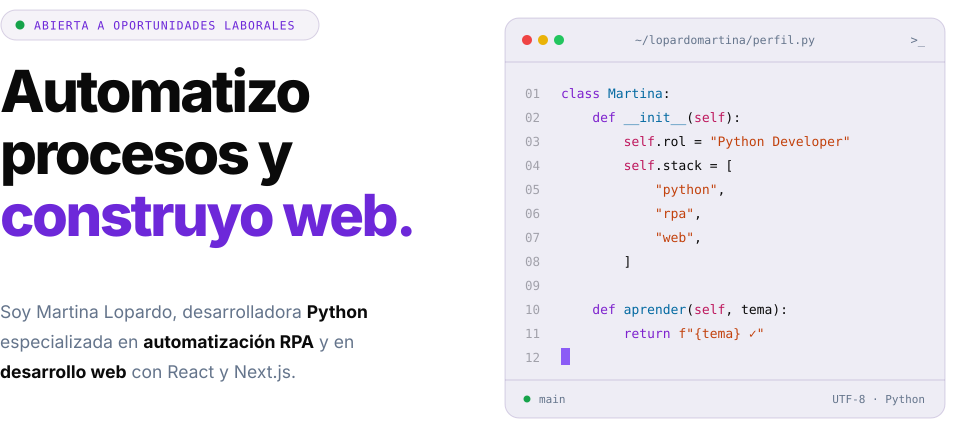
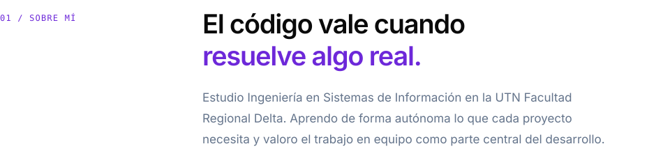
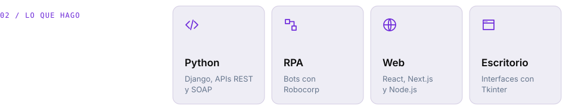
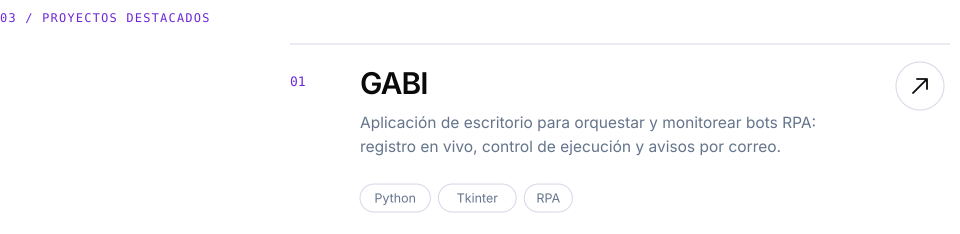

<!-- Las imágenes se generan con generar_svg.py: editá los textos ahí y volvé a ejecutarlo. -->

<picture><source media="(prefers-color-scheme: dark)" srcset="assets/hero-dark.svg"></picture>

<a href="https://lopardomartina.github.io/"><picture><source media="(prefers-color-scheme: dark)" srcset="assets/btn-portfolio-dark.svg"></picture></a>&nbsp;&nbsp;<a href="mailto:Martulopardo0@gmail.com"><picture><source media="(prefers-color-scheme: dark)" srcset="assets/btn-email-dark.svg"></picture></a>

  

<picture><source media="(prefers-color-scheme: dark)" srcset="assets/sobre-mi-dark.svg"></picture>

 

<picture><source media="(prefers-color-scheme: dark)" srcset="assets/lo-que-hago-dark.svg"></picture>

 

<a href="https://github.com/lopardomartina/REPO-GABI"><picture><source media="(prefers-color-scheme: dark)" srcset="assets/proyecto-gabi-dark.svg"></picture></a>

<a href="https://github.com/lopardomartina/REPO-YL"><picture><source media="(prefers-color-scheme: dark)" srcset="assets/proyecto-yl-nutricion-dark.svg"></picture></a>

<a href="https://github.com/lopardomartina/REPO-VIALKIDS"><picture><source media="(prefers-color-scheme: dark)" srcset="assets/proyecto-vialkids-dark.svg"></picture></a>

---

[Portfolio](https://lopardomartina.github.io/) · [LinkedIn](https://www.linkedin.com/in/martina-lopardo) · [Correo](mailto:Martulopardo0@gmail.com)

Buenos Aires, Argentina

